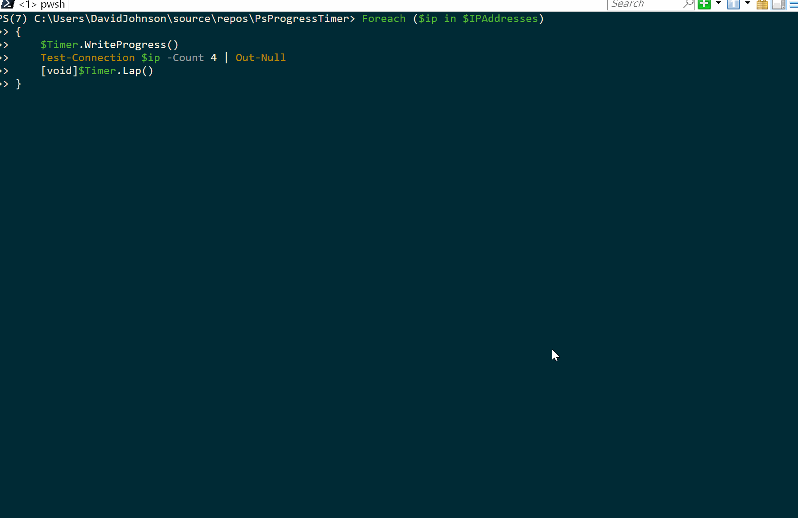

# PsProgressTimer
A PowerShell helper module for Write-Progress

## What's this then? Why do I need it?
You and your end users like rich, detailed and actually useful progress messages for your long running processes right? Everyone likes the warm fuzzy feeling of knowing their machine hasn't crashed and is working dilligently on their behalf.
Can you always be bothered to code up accurate PercentComplete and SecondsRemaining values to show that level of detail? I know I can't.
What if it was always simple?

## Huh? Show me

Sure. Well this code:

```powershell
$IPAddresses = Get-Content MyServerAddresses.txt
$Timer = New-ProgressTimer -TotalCount $IPAddresses.Count -ActivityText "Pinging..." -StatusScript {$ip} -Start
Foreach ($ip in $IPAddresses)
{
    $Timer.WriteProgress()
    Test-Connection $ip -Count 4
    [void]$Timer.Lap()
}
```

Gets you this output:



## Neat. What else can it do?

In your code, not every loop may necessarily have a completed action. But you still want the progress bar to update to reflect that work is ongoing, right? Use `$Timer.UpdateDuration()` instead of `.Lap()` and the next call of `.WriteProgress()` will have updated timing information without incrementing the percent complete bar.

## But my code monitors a background process and multiple or no jobs might complete in each loop.

Gotcha covered there too. Simply call `.Lap($n)` where `$n` is the number of tasks completed. The timing information will update as if you'd called `Lap()` for each one as it actually completed. Zero is a perfectly valid value here as well, it acts as if you'd simply called `.UpdateDuration()` instead.

## Cool. What else.

Check the examples via `Get-Help New-PsProgressTimer -Examples` for more ideas!